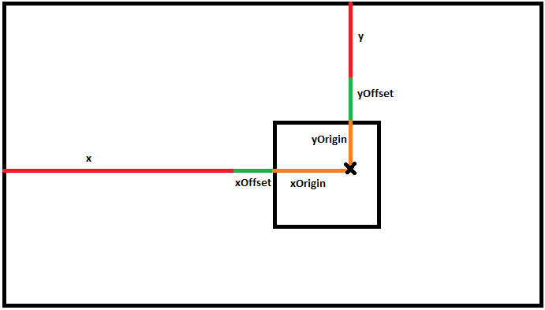

.. _Layouts:

**********
Layouts
**********
A layout defines your user experience for displaying a collection. The layout XML file defines where graphical components are displayed, what audio is played, and how to animate components when certain events occur.

Each collection can have its own layout. Edit your :ref:`ConfigurationCollections` files to pick your layout.

File format
####################

All XML tags must be inside the root layout tag.

.. code-block:: xml

   <layout>
      ... 
   </layout>

<layout> attributes
===================

===========================      =====================================================================================================================================
Attribute                        Description
===========================      =====================================================================================================================================
width                            The virtual width to use for this layout. This will be scaled automatically by the frontend if the screen resolution is different.
height                           The virtual height to use for this layout. This will be scaled automatically by the frontend if the screen resolution is different. 
font                             Location of the font (relative to the layout folder). TTF is only supported.
fontColor                        RGB color of the font (in hex, i.e. "336699")
loadFontSize                     The size of the font to load. Lower font sizes is more blurred, Higher font sizes are a little more pixelated. 24 is an ideal value.
===========================      =====================================================================================================================================

The following example uses a layout that is setup for 1024x768 pixels (4:3 aspect ratio). The frontend will handle layout scaling if your monitor runs at a larger resolution
and is of the same aspect ratio (i.e 1600x1200). The frontend will still handle layout scaling if the aspect ratio is different, however, your image will look stretched 
(i.e 1920x1080 resolution, 16:9 aspect ratio). 

.. code-block:: xml

   <layout width="1024" height="768">
      ...
   </layout>

The following example sets the menu font to Age.otf with a color of Royal Blue Red=41(65) Green=69(105) Blue=E1(225)

.. code-block:: xml

   <layout width="1024" height="768" font="Age.otf" fontColor="FF6633">
      <!-- menu items go inside here --> 
   </layout>
   
Components
##########

A component is a graphical item to be displayed on your screen (i.e. a menu, image, video, text).

===========================      ===========================================================================
Top Level Components             Description
===========================      ===========================================================================
<menu>                           Menu for layout (can only contain one menu per layout)
<container>                      An empty container block (typically used for creating colored blocks)
<image>                          Display a single image (i.e. a background image)
<reloadableImage>                An image that is reloaded with one for a particular selected item
<reloadableVideo>                Display a video for the selected item
<reloadableText>                 Display text for the selected item
<text>                           Display custom text
===========================      ===========================================================================

Component attributes
====================

Each component (listed above) supports the following attributes:

===========================      ================================================================================
Attribute                        Description
===========================      ================================================================================
x                                X coordinate of where to place the component
y                                Y coordinate of where to place the component
xOffset                          Relative X offset of how many pixels to shift the object from x (x + xOffset)
yOffset                          Relative Y offset of how many pixels to shift the object from y (y + yOffset)
xOrigin                          X offset on image to use as the pin point for placement
yOrigin                          Y offset on image to use as the pin point for placement
alpha                            0 = 0% visible, 0.5=50% visible, 1=100% visible
angle                            Angle to rotate image, in degrees
width                            Width of the component. Image will be scaled appropriately if not specified.
height                           Height of the component. Image will be scaled appropriately if not specified.
minWidth                         Minimum width to allow the image to be (if scaling is needed)
minHeight                        Minimum height to allow the image to be (if scaling is needed)
maxWidth                         Maximum width to allow the image to be (if scaling is needed)
maxHeight                        Maximum height to allow the image to be (if scaling is needed)
fontSize						             Size of font to display component is rendering text
backgroundColor                  Fill the component with a background color
backgroundAalpha                 Background color transparency: 0 = 0% visible, 0.5=50% visible, 1=100% visible
===========================      ================================================================================

(As a reminder, all examples shown below must be inside a <layout> tag)

Relative Positioning Diagram
^^^^^^^^^^^^^^^^^^^^^^^^^^^^^

Attribute values (alignment)
^^^^^^^^^^^^^^^^^^^^^^^^^^^^^
Keywords can be passed into the values of some attributes for alignment.

All horizontal based attributes (i.e. x, xOffset, xOrigin, width, minWidth, maxWidth) can support the following values: "left", "center", "right", "stretch"

All vertical based attributes (i.e. x, yOffset, yOrigin, height, minHeight, maxHeight) can support the following values: "top", "center", "bottom", "stretch"

Display an image stretched across the the screen
^^^^^^^^^^^^^^^^^^^^^^^^^^^^^^^^^^^^^^^^^^^^^^^^^^

.. code-block:: xml

   <image x="0" y="0" width="stretch" height="stretch" source="background.png"/>

Display an image centered on the screen
^^^^^^^^^^^^^^^^^^^^^^^^^^^^^^^^^^^^^^^^^^^^^^^^^^

.. code-block:: xml

   <image x="center" y="center" xOrigin="center" yOrigin="center" width="200" height="300" />

Display an image aligned at the bottom right of the screen
^^^^^^^^^^^^^^^^^^^^^^^^^^^^^^^^^^^^^^^^^^^^^^^^^^^^^^^^^^^^^^

Use the bottom rightmost pixel as the reference point when displaying on the screen and display at the bottom rightmost position.

.. code-block:: xml

   <image x="right" y="bottom" xOrigin="right" yOrigin="bottom" width="200" height="300" />

Display an image being offset 100 pixels from the right of the page (vertically centered)
^^^^^^^^^^^^^^^^^^^^^^^^^^^^^^^^^^^^^^^^^^^^^^^^^^^^^^^^^^^^^^^^^^^^^^^^^^^^^^^^^^^^^^^^^^^^

Use the rightmost (vertical center) pixel as a reference point when displaying on the screen.
Display at the right-center area of the page.
Offset the image to the left by 100 pixels.

.. code-block:: xml

   <image x="right" y="center" xOrigin="right" yOrigin="center" xOffset="-100" yOffset="0" width="300" height="300" />

Animations
###########

The animation engine is very flexible. You can move, rotate, scale, and make images transparent. See the basic example XML for performing an animation. The sections below explain what each tag is responsible for.

.. code-block:: xml

   <!-- Move an image from the top left to the center of the screen for 1 second. 
        Then move the image from the center of the screen to the bottom of the screen in 0.5 seconds -->

   <image xOrigin="center" yOrigin="bottom" width="200" height="300">
      <onEnter>
         <set duration="1">
            <animation type="x" from="0" to="center" algorithm="linear">
            <animation type="y" from="0" to="center" algorithm="linear">
         </set>
         <set duration="0.5">
            <animation type="y" from="center" to="bottom" algorithm="linear">
         </set>
      </onEnter>
   </image>

=====================================      =================================================================================================
Tag (in example above)                     Description
=====================================      =================================================================================================
<image>                                    The component to animate. In this case it is an image.
<onEnter>                                  When to trigger the event. In this case it will be triggered when the page is first loaded.
<set>                                      Groups component properties to animate. In this case the first group animates the x and y coordinates
                                           together for one second and then later animates the y axis for half a second.
<animation>                                Defines the start, end, and algorithm to use for animating a property (in this case the X and Y position).
<onIdle>                                   Event that is continuously looped when there is no active input (when the menu is idling)
=====================================      =================================================================================================

Events
===================

The following animations are supported by all component tags. 

=====================================      =================================================================================================
Tag                                        Description
=====================================      =================================================================================================
<onEnter>                                  Events that are triggered when the layout first starts
<onExit>                                   Events that are triggered when the layout exits
<onHighlightExit>                          Events that are triggered when the currently highlighted item is no longer highlighted
<onHighlightEnter>                         Events that are triggered when the item is highlighted
<onIdle>                                   Event that is continuously looped when there is no active input (when the menu is idling)
=====================================      =================================================================================================

.. code-block:: xml

   <image xOrigin="center" yOrigin="bottom" width="200" height="300">
      <onEnter>
         <!-- add animation sets here for when you first enter the page -->
      </onEnter>

      <onExit>
          <!-- add animation sets here for when you exit the page -->
      </onExit>

      <onHighlightEnter>
          <!-- add animation sets here to run when a new item is highlighted -->
      </onHighlightEnter>

      <onHighlightExit>
          <!-- add animations here for when a new item in the menu is highlighted 
               (how to animate the previously selected item) -->
      </onHighlightExit>
   <image>

<set> animation tag
===================
An animation <set> is a collection of animation properties to change at the same time. You can "daisy chain" multiple animations.

.. code-block:: xml

   <image>
      <onIdle>
         <set duration="1">
            <!-- animate certain properties for one second -->
         </set>
         <set duration="0.5">
            <!-- animate certain properties for 0.5 seconds after the last animation set has completed -->
         </set>
      </onIdle>
   <image>

<animation> tag
===============
An animation tag defines what property to animate. 

===========================      ==================================================================================================================================
Attribute                        Description
===========================      ==================================================================================================================================
type                             Component property to animate. Supported types are: x, y, width, height, transparency, angle, xOrigin, yOrigin, xOffset, yOffset
from                             Starting value
to                               Ending value
algorithm                        Motion (tweening) algorithm. Defaults to linear if not specified. See Animation algorithms for more information.
===========================      ==================================================================================================================================

The following example animates an image on the x axis to move from the left to the right of the screen in 1 second.

.. code-block:: xml

   <image xOrigin="center" yOrigin="bottom" width="200" height="300">
      <onIdle>
         <set duration="1">
            <animation type="x" from="left" to="right" algorithm="linear">
         </set>
      </onIdle>
   </image>

The following example animates an image on the x axis to move from the top left to the bottom right of the screen in 1 second.

.. code-block:: xml

   <image xOrigin="center" yOrigin="bottom" width="200" height="300">
      <onIdle>
         <set duration="1">
            <animation type="x" from="left" to="right" algorithm="linear">
            <animation type="y" from="top" to="bottom" algorithm="linear">
         </set>
      </onIdle>
   </image>

Animation algorithms
^^^^^^^^^^^^^^^^^^^^^
See http://gizma.com/easing/ for examples on how each animation operates.

=====================================      =================================================================================================
Algorithm                                  Description
=====================================      =================================================================================================
linear                                     no easing, no acceleration (default if none is specified)
easeinquadratic                            accelerating from zero velocity
easeoutquadratic                           deaccelerating from zero velocity
easeinoutquadratic                         acceleration until halfway, then deceleration
easeincubic                                accelerating from zero velocity
easeoutcubic                               deaccelerating from zero velocity
easeinoutcubic                             acceleration until halfway, then deceleration
easeinquartic                              accelerating from zero velocity
easeoutquartic                             deaccelerating from zero velocity
easeinoutquartic                           acceleration until halfway, then deceleration
easeinquintic                              accelerating from zero velocity
easeoutquintic                             deaccelerating from zero velocity
easeinoutquintic                           acceleration until halfway, then deceleration
easeinsinusoidal                           accelerating from zero velocity
easeoutsinusoidal                          deaccelerating from zero velocity
easeinoutsinusoidal                        acceleration until halfway, then deceleration
easeinexponential                          accelerating from zero velocity
easeoutexponential                         deaccelerating from zero velocity
easeinoutexponential                       acceleration until halfway, then deceleration
easeincircular                             accelerating from zero velocity
easeoutcircular                            deaccelerating from zero velocity
easeinoutcircular                          acceleration until halfway, then deceleration
=====================================      =================================================================================================

Daisy chained animation example
================================

Take an image and move it from the top left of the screen to the center in 1 second. After the animation completes move the image
from the center of the screen to the bottom center of the screen in 0.5 seconds.

.. code-block:: xml

   <image xOrigin="center" yOrigin="bottom" width="200" height="300">
      <onEnter>
         <set duration="1">
            <animation type="x" from="0" to="center" algorithm="linear">
            <animation type="y" from="0" to="center" algorithm="linear">
         </set>
         <set duration="0.5">
            <animation type="y" from="center" to="bottom" algorithm="linear">
         </set>
      </onEnter>
   </image>

Fully animating
================================

While this example may not be practical; it showcases all the properties that can be animated.

.. code-block:: xml

   <image xOrigin="center" yOrigin="bottom" width="200" height="300">
      <onIdle>
         <set duration="1">
            <animation type="x"            from="left" to="right"  algorithm="linear">
            <animation type="y"            from="top"  to="bottom" algorithm="linear">
            <animation type="xOffset"      from="left" to="right"  algorithm="linear">
            <animation type="yOffset"      from="0"    to="20"     algorithm="linear">
            <animation type="xOrigin"      from="0"    to="30"     algorithm="easeinoutquintic">
            <animation type="yOrigin"      from="0"    to="20"     algorithm="linear">
            <animation type="transparency" from="0"    to="1"      algorithm="easeinoutquintic">
            <animation type="angle"        from="0"    to="360"    algorithm="linear">
            <animation type="height"       from="0"    to="300"    algorithm="easeinoutquadratic">
            <animation type="width"        from="0"    to="180"    algorithm="easeincircular">
         </set>

         <set duration="0.5">
            <animation type="x"            from="right"  to="left" algorithm="linear">
            <animation type="y"            from="bottom" to="top"  algorithm="linear">
            <animation type="xOffset"      from="right"  to="left" algorithm="linear">
            <animation type="yOffset"      from="20"     to="0"    algorithm="linear">
            <animation type="xOrigin"      from="30"     to="0"    algorithm="easeinoutquintic">
            <animation type="yOrigin"      from="20"     to="0"    algorithm="linear">
            <animation type="transparency" from="1"      to="0"    algorithm="easeinoutquintic">
            <animation type="angle"        from="360"    to="0"    algorithm="linear">         
            <animation type="height"       from="300"    to="0"    algorithm="easeinoutquadratic">
            <animation type="width"        from="180"    to="0"    algorithm="easeincircular">
         </set>
      </onIdle>
   </image>

Images
####################

Component attributes
====================

See below for a list of supported attributes (in addition to the standard component attributes listed above)

===========================      ================================================================================
Attribute                        Description
===========================      ================================================================================
src                              location of the source image (relative to the layout folder)
===========================      ================================================================================

For example, if you want to display picture of an Nintendo console (named "NES Console.png" in your layout folder), you would do the following:

.. code-block:: xml

   <image src="NES Console.png" x="center" y="center" height="200" />

Reloadable Images
##############################

Displays image for the currently highlighted menu item.

Component attributes
====================

See below for a list of supported attributes (in addition to the standard component attributes listed above).

===========================      =====================================================================================================================================================================
Attribute                        Description
===========================      =====================================================================================================================================================================
type                             Type of image to display (using the selected item).
===========================      =====================================================================================================================================================================

For example, if you want to display a snap shot of the selected menu item, you would do the following in your Layout.xml file:

.. code-block:: xml

   <reloadableImage type="snap" x="center" y="center" height="200" />

Your Settings.conf file will have the following line

.. code-block:: xml

   media.snap = D:/Video Game Artwork/Nintendo/Snaps

If an item titled "Tetris (USA)" was selected, the reloadable image component will try to load "D:/Video Game Artwork/Nintendo/Snaps/Tetris (USA).png". If no image could be found than nothing
will be displayed.

Reloadable Videos
##############################

Displays video for the currently highlighted menu item.

Component attributes
====================

See below for a list of supported attributes (in addition to the standard component attributes listed above).

===========================      =====================================================================================================================================================================
Attribute                        Description
===========================      =====================================================================================================================================================================
imageType                        Type of image to display if the video could not be found (using the selected item).
===========================      =====================================================================================================================================================================

For example, if you want to display a video of the selected menu item, you would do the following in your Layout.xml file:

.. code-block:: xml

   <reloadableVideo  x="center" y="center" height="200" />

Your Settings.conf file will have the following line

.. code-block:: xml

   media.video = D:/Video Game Artwork/Nintendo/Videos

If an item titled "Tetris (USA)" was selected, the reloadable image component will try to load "D:/Video Game Artwork/Nintendo/Videos/Tetris (USA).png". If no image could be found than nothing
will be displayed.

If you do not want to display an image component if the video does not exist, simply do not specify an imageType attribute:

.. code-block:: xml

   <reloadableVideo x="center" y="center" height="200" />

Reloadable Text
##############################

Displays textual info for the currently selected item

Component attributes
====================

See below for a list of supported attributes (in addition to the standard component attributes listed above).

===========================      =====================================================================================================================================================================
Attribute                        Description
===========================      =====================================================================================================================================================================
type                             Valid values are: numberButtons, numberPlayers, year, title, manufacturer
===========================      =====================================================================================================================================================================

Example to display the manufacturer and title for the selected game
.. code-block:: xml

   <reloadableText type="manufacturer"  x="0" y="0" fontSize="20" height="30"/>
   <reloadableText type="title"  0="0" y="60" fontSize="20" height="30"/>

   
Rendering Text
##############################

Displays static text on the screen

Component attributes
====================

See below for a list of supported attributes (in addition to the standard component attributes listed above).

===========================      =====================================================================================================================================================================
Attribute                        Description
===========================      =====================================================================================================================================================================
value                            Contents of the text to display
===========================      =====================================================================================================================================================================

For example, if you want to display a video of the selected menu item, you would do the following in your Layout.xml file:

.. code-block:: xml

   <text value="RetroFE rocks!"  x="center" y="center" height="200" />

Menu
###########

The menu supports animations just like every other component. There can be only one menu per layout.

Component attributes
====================

See below for a list of supported attributes (in addition to the standard component attributes listed above).

===========================      =====================================================================================================================================================================
Attribute                        Description
===========================      =====================================================================================================================================================================
type                             set to "custom" if you desire to pick individual points (absolute points). Use this mode when doing a showcase, wheel, etc...
===========================      =====================================================================================================================================================================

menu <itemDefaults> tag
=========================
  Specifies the default values for each item. 

   <menu orientation="horizontal" algorithm="easeincircular" xOffset="500" y="10" width="center" height="1040" speed="0.05" acceleration="0.05">
    
menu <itemDefaults> tag
===============================
Item defaults define the normal properties of each menu item on a page. All component attributes can be used in here along with the following attributes:

===========================      =====================================================================================================================================================================
Attribute                        Description
===========================      =====================================================================================================================================================================
spacing                          Pixel spacing between each menu item (ignored when using the menu in custom mode)
index                            Specify a options for a particular menu item when in list mode (first=first visible item, last=last visible item, start= first - 1, end - last + 1)
===========================      =====================================================================================================================================================================
    

    
menu <item> tag in custom mode
===============================

Each menu <item> tag represents a point on where to display a scrolling list item in the menu. When scrolling, the items themselves will scroll/move from one item point to another.
If an attribute in <item> is not specified, it will use the attribute specified in the <itemDefaults> tag.

.. code-block:: xml

   <menu type="custom">
      <itemDefaults x="center" y="20" fontColor="FFCC00" layer="3"/>
      <item xOrigin="center" yOrigin="20" />
      <item xOrigin="center" yOrigin="40" />
      <item xOrigin="center" yOrigin="60" />
      <item xOrigin="center" yOrigin="80" />
      <item xOrigin="center" yOrigin="100" />
      <item xOrigin="center" yOrigin="120" />
   </menu>

menu <item> tag in list mode (default)
=========================================

Each menu <item> tag represents an offset relative to the predefined menu x,y location. When scrolling, the items themselves will scroll/move from one item point to another.
If an attribute in <item> is not specified, it will use the attribute specified in the <itemDefaults> tag.

.. code-block:: xml

   <menu orientation="horizontal" algorithm="easeincircular" xOffset="500" y="10" width="center" height="1040" speed="0.05" acceleration="0.05">
    <itemDefaults spacing="10" x="center" height="35" fontSize="35" alpha="0.5" xOffset="20" yOrigin="center"  layer="3"/>
    <item index="start" height="0" spacing="0" alpha="0"/>
    <item index="2" spacing="0" height="60" fontSize="60" alpha="1" selected="true"/>
    <item index="end" height="0" spacing="0" alpha="0"/>
   </menu>

   
Animating the menu and list items
==================================
Not only can the entire menu have an animation performed, the menu item at a particular point can also be animated. See below:

.. code-block:: xml

   <menu x="center" y="20" fontColor="FFCC00">
      <!-- have the entire menu jiggle to the left and the right -->
      <onIdle>
         <set duration="0.5">
            <animation type="xOffset" from="0" to="-10">
         </set>
         <set duration="0.5">
            <animation type="xOffset" from="-10" to="0">
         </set>
      </onIdle>

      <item xOrigin="center" yOrigin="20" />
      <item xOrigin="center" yOrigin="40" />

      <item xOrigin="center" yOrigin="60" selected="true">
         <!-- have this single menu item jiggle up and down -->
         <onIdle>
            <set duration="0.5">
               <animation type="yOffset" from="0" to="-10">
            </set>
            <set duration="0.5">
               <animation type="yOffset" from="-10" to="0">
            </set>
         </onIdle>
      </item>

      <item xOrigin="center" yOrigin="80" />
      <item xOrigin="center" yOrigin="100" />
      <item xOrigin="center" yOrigin="120" />
   </menu>

Sounds
#######
In addition to displaying graphical components, the frontend supports sound effects that are triggered when certain events occur.

===============================      =================================================================================================
Tag                                  Description
===============================      =================================================================================================
<onLoad>                             Sound triggered when the layout is started
<onUnload>                           Sound triggered when the layout is exited
<highlight>                          Sound triggered when a new item is highlighted. This will not loop while actively scrolling. 
<select>                             Sound triggered when an item is selected2
===============================      =================================================================================================

Each sound effect supports the following parameters:

===========================      =====================================================================================================================================================================
Attribute                        Description
===========================      =====================================================================================================================================================================
src                              Location of the sound file (relative to the layout folder).
===========================      =====================================================================================================================================================================

.. code-block:: xml

   <onLoad src="load.wav" /">
   <onLoad src="unload.wav" /">
   <onLoad src="highlight.wav" /">
   <onLoad src="select.wav" /">

